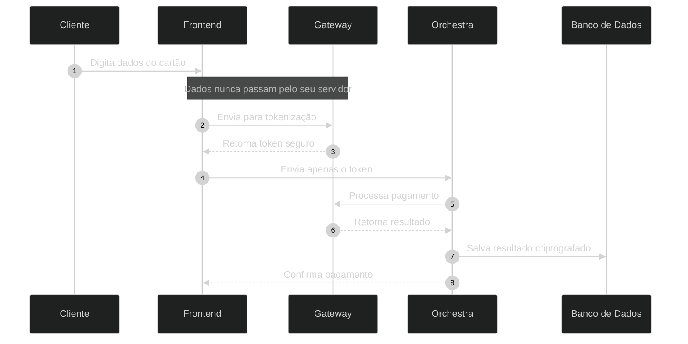
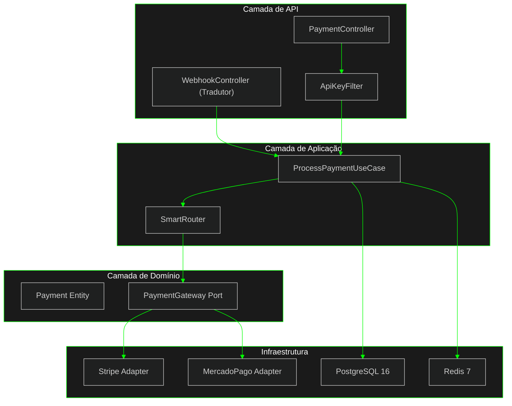
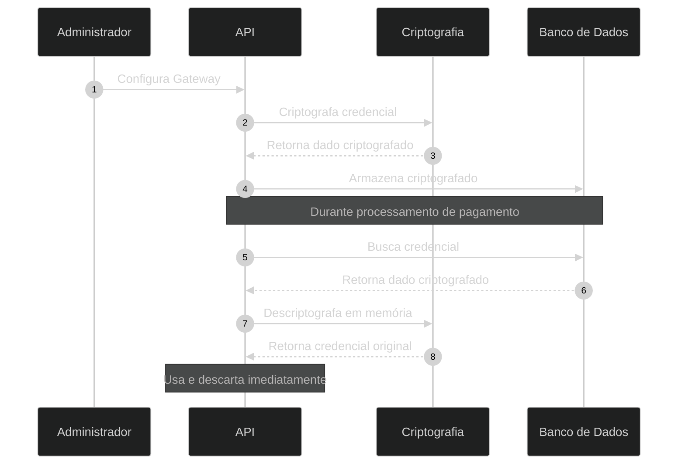

# Orchestra.io

<div align="center">

**Plataforma de Orquestração de Pagamentos**

[](https://opensource.org/licenses/MIT)
[](https://openjdk.java.net/)
[](https://spring.io/projects/spring-boot)
[](https://www.postgresql.org/)
[](https://redis.io/)

</div>

```
 ____            __              __                 _     
/ __ \________  / /_  ___  _____/ /_________ _     (_)___ 
/ / / / ___/ __ \/ __ \/ _ \/ ___/ __/ ___/ __ `/   / / __ \
/ /_/ / /  / /_/ / / / /  __(__  ) /_/ /  / /_/ /   / / /_/ /
\____/_/   \____/_/ /_/\___/____/\__/_/   \__,_(_) /_/\____/ 
```

<div align="center">

### Uma integração. Múltiplos gateways de pagamento.

[Ver Documentação](#referência-da-api) · [Reportar Problemas](https://github.com/vitinh0z/orchestra.io/issues) · [Sugerir Melhorias](https://github.com/vitinh0z/orchestra.io/discussions)

</div>

---

## Por que Orchestra.io?

### O Problema

Sua empresa vende produtos no Brasil e no exterior. Clientes brasileiros querem pagar com PIX. Clientes internacionais precisam usar cartão de crédito.

Resultado: você precisa integrar múltiplos sistemas de pagamento.

```diff
- Stripe para pagamentos internacionais
- MercadoPago para pagamentos no Brasil
- Dois códigos diferentes para manter
- Duas integrações para corrigir quando quebram
- Dobro de trabalho e complexidade
```

### A Solução

Orchestra.io unifica tudo em uma única integração:

```javascript
// Um único código funciona para qualquer moeda
const pagamento = await orchestra.processar({
  valor: 197.00,
  moeda: "BRL",           // Automaticamente usa MercadoPago
  metodoPagamento: "pix"
});

// Mesma interface para pagamentos internacionais
const payment = await orchestra.processar({
  valor: 49.00,
  moeda: "USD",           // Automaticamente usa Stripe
  metodoPagamento: "card"
});
```

**Resultado:** Um código. Menos manutenção. Menos dor de cabeça.

---

## Principais Recursos

### Roteamento Automático

O sistema escolhe automaticamente o melhor gateway baseado na moeda:

| Moeda | Gateway Principal | Gateway Alternativo | Métodos Disponíveis |
|-------|------------------|---------------------|---------------------|
| BRL | MercadoPago | Stripe | PIX, Boleto, Cartão |
| USD | Stripe | PayPal (Planejado) | Cartão, Apple Pay |
| EUR | Stripe | Adyen (Planejado) | Cartão, SEPA |

### Tradutor Universal de Webhooks

**Gateways te ajudam a cobrar. O Orchestra.io te ajuda a não enlouquecer com a integração.**

Em vez de o seu time de backend ter que tratar 5 formatos diferentes de Webhook (Stripe, MercadoPago, PayPal...), o Orchestra.io **normaliza tudo**.

**Você integra UMA vez. Nós traduzimos o resto.**

| Gateway | O que eles mandam (O Caos) | O que você recebe (Orchestra) |
|---------|---------------------------|-------------------------------|
| **Stripe** | `{ "type": "payment_intent.succeeded", ... }` | `{ "status": "APPROVED" }` |
| **MercadoPago** | `{ "action": "payment.created", ... }` | `{ "status": "APPROVED" }` |
| **PayPal** | `{ "event_type": "PAYMENT.CAPTURE.COMPLETED" }` | `{ "status": "APPROVED" }` |

> **Resultado:** Se você trocar de Gateway no futuro, seu código de webhook **não precisa mudar**.

### Segurança por Design

Orchestra.io nunca armazena dados sensíveis de cartão. Tudo é tokenizado antes de chegar no servidor.



**Seu servidor nunca vê dados de cartão. Conformidade simplificada.**

### Proteção Contra Duplicação

Sistema de proteção evita cobranças duplicadas em caso de requisições repetidas:

| Recurso | Status | Benefício |
|---------|--------|-----------|
| **Idempotência** | Implementado | Mesmo pagamento não é cobrado 2x |
| **Bloqueio Distribuído** | Implementado | Funciona com múltiplos servidores |
| **Retry Automático** | Em desenvolvimento | Tenta novamente se gateway falhar |
| **Circuit Breaker** | Planejado | Isola gateways com problemas |
| **Métricas em Tempo Real** | Planejado | Dashboard de performance |

### Isolamento por Cliente

Cada cliente tem suas próprias credenciais e dados completamente separados:

```java
// Cada empresa tem suas configurações isoladas
POST /v1/tenants
{
  "name": "Minha Empresa",
  "gateways": {
    "stripe": "sk_live_...",      // Criptografado com AES-256
    "mercadopago": "APP_USR_..."  // Criptografado com AES-256
  }
}

// Requisições autenticadas por chave única
Headers: X-Orchestra-Key: tenant_abc123
```

**Dados de um cliente nunca vazam para outro.**

---

## Arquitetura

### Estrutura do Sistema



### Princípios de Design

| Princípio | Como Aplicamos |
|-----------|----------------|
| **Separação de Responsabilidades** | Cada camada tem função específica |
| **Independência de Frameworks** | Regras de negócio não dependem de tecnologias específicas |
| **Extensível** | Fácil adicionar novos gateways sem modificar código existente |
| **Testável** | Mais de 80% de cobertura de testes |

---

## Como Começar

### Requisitos

```bash
Java 21 ou superior
Docker e Docker Compose
Maven 3.8 ou superior
```

### Instalação

```bash
# 1. Clone o projeto
git clone https://github.com/vitinh0z/orchestra.io.git
cd orchestra.io

# 2. Inicie a infraestrutura
docker-compose up -d
# PostgreSQL estará disponível em localhost:5432
# Redis estará disponível em localhost:6379

# 3. Configure suas credenciais
cp .env.example .env
# Edite o arquivo .env com suas chaves de teste

# 4. Execute a aplicação
./mvnw clean install
./mvnw spring-boot:run
```

**API estará disponível em `http://localhost:8080`**

### Seu Primeiro Pagamento

```bash
# 1. Crie uma conta
curl -X POST http://localhost:8080/v1/tenants \
  -H "Content-Type: application/json" \
  -d '{
    "name": "Minha Empresa",
    "gateways": {
      "mercadopago": "TEST-123456-abcdef"
    }
  }'

# Resposta: { "apiKey": "orch_abc123..." }

# 2. Processe um pagamento PIX
curl -X POST http://localhost:8080/v1/payments \
  -H "Content-Type: application/json" \
  -H "X-Orchestra-Key: orch_abc123..." \
  -H "Idempotency-Key: pedido-001" \
  -d '{
    "amount": 197.00,
    "currency": "BRL",
    "paymentMethod": { "type": "pix" }
  }'
```

**Resposta:**
```json
{
  "id": "pay_xyz789",
  "status": "pending",
  "pix": {
    "qr_code": "00020126580014br.gov.bcb.pix...",
    "expires_at": "2026-01-20T18:30:00Z"
  }
}
```

---

## Referência da API

### Processar Pagamento

**Endpoint:** `POST /v1/payments`

**Cabeçalhos obrigatórios:**
```http
Content-Type: application/json
X-Orchestra-Key: sua_chave_api
Idempotency-Key: identificador_unico
```

**Exemplo de requisição (PIX):**
```json
{
  "amount": 197.00,
  "currency": "BRL",
  "paymentMethod": {
    "type": "pix"
  },
  "customer": {
    "email": "cliente@exemplo.com",
    "document": "12345678900"
  }
}
```

**Exemplo de requisição (Cartão):**
```json
{
  "amount": 49.99,
  "currency": "USD",
  "paymentMethod": {
    "type": "card_token",
    "token": "tok_visa_4242"
  },
  "customer": {
    "email": "customer@example.com"
  }
}
```

**Resposta de sucesso:**
```json
{
  "id": "pay_abc123",
  "status": "approved",
  "amount": 49.99,
  "currency": "USD",
  "gateway": {
    "provider": "stripe",
    "transaction_id": "ch_3ABC..."
  },
  "created_at": "2026-01-20T18:00:00Z"
}
```

### Métodos de Pagamento

| Método | Código | Gateways Suportados | Disponível em |
|--------|--------|---------------------|---------------|
| **PIX** | `pix` | MercadoPago | Brasil |
| **Boleto** | `boleto` | MercadoPago | Brasil |
| **Cartão de Crédito** | `card_token` | Stripe, MercadoPago, PayPal (Breve) | Global |
| **Cartão de Débito** | `card_token` | Stripe, MercadoPago | Global |

---

## Segurança

### Criptografia de Credenciais

Credenciais dos gateways são criptografadas antes de serem armazenadas:



### Práticas de Segurança

| Prática | Implementação |
|---------|---------------|
| **Validação Constante** | Toda requisição valida chave de API |
| **Privilégios Mínimos** | Chaves com permissões limitadas |
| **Múltiplas Camadas** | Várias barreiras de proteção |
| **Auditoria Completa** | Log de todas as transações |
| **Sem Dados Sensíveis em Logs** | Informações críticas nunca aparecem em logs |

---

## Testes

### Cobertura de Testes

```
Domínio:           95%
Aplicação:         85%
Infraestrutura:    70%
Geral:             83%
```

### Executar Testes

```bash
# Testes unitários
./mvnw test

# Testes de integração
./mvnw verify -P integration-tests

# Gerar relatório de cobertura
./mvnw jacoco:report
open target/site/jacoco/index.html
```

### Cartões de Teste

Use estes cartões no ambiente de testes do Stripe:

| Tipo | Número | Resultado Esperado |
|------|--------|-------------------|
| Visa Aprovado | `4242 4242 4242 4242` | Pagamento aprovado |
| Mastercard Aprovado | `5555 5555 5555 4444` | Pagamento aprovado |
| Recusado | `4000 0000 0000 9995` | Saldo insuficiente |
| Requer Autenticação | `4000 0025 0000 3155` | Solicita 3D Secure |

---

## Tecnologias Utilizadas

### Principais

| Componente | Tecnologia | Versão |
|-----------|-----------|--------|
| **Linguagem** | Java | 21 |
| **Framework** | Spring Boot | 3.x |
| **Build** | Maven | 3.8+ |

### Infraestrutura

| Componente | Tecnologia | Propósito |
|-----------|-----------|----------|
| **Banco de Dados** | PostgreSQL | Armazenamento de transações |
| **Cache** | Redis | Proteção contra duplicação |
| **Métricas** | Prometheus | Coleta de dados de performance |
| **Visualização** | Grafana | Dashboards e gráficos |

### Bibliotecas Principais

```xml
<!-- Proteção contra falhas e retry automático -->
<dependency>
    <groupId>io.github.resilience4j</groupId>
    <artifactId>resilience4j-spring-boot3</artifactId>
</dependency>

<!-- Processamento de JSON -->
<dependency>
    <groupId>com.fasterxml.jackson.core</groupId>
    <artifactId>jackson-databind</artifactId>
</dependency>

<!-- Persistência de dados -->
<dependency>
    <groupId>org.springframework.boot</groupId>
    <artifactId>spring-boot-starter-data-jpa</artifactId>
</dependency>
```

---

## Como Contribuir

Contribuições são bem-vindas. Este é um projeto de código aberto para a comunidade.

### Processo

1. Faça um fork do repositório
2. Crie uma branch: `git checkout -b minha-melhoria`
3. Faça suas alterações seguindo os padrões do projeto
4. Escreva testes (mínimo 80% de cobertura)
5. Commit: `git commit -m "Adiciona suporte para PayPal"`
6. Push: `git push origin minha-melhoria`
7. Abra um Pull Request

### Padrões

| Aspecto | Referência |
|---------|-----------|
| **Estilo de Código** | Google Java Style Guide |
| **Mensagens de Commit** | Conventional Commits |
| **Arquitetura** | Clean Architecture |
| **Documentação** | Javadoc para APIs públicas |

### Onde Ajudar

- Encontrou um bug? Abra uma [issue](https://github.com/vitinh0z/orchestra.io/issues)
- Tem uma sugestão? Inicie uma [discussão](https://github.com/vitinh0z/orchestra.io/discussions)
- Quer adicionar um gateway? Implemente a interface `PaymentGateway`
- Melhorar documentação? Pull requests são muito apreciados

---

## Status do Projeto

| Informação | Status |
|-----------|--------|
| **Build** | Funcionando |
| **Cobertura de Testes** | 83% |
| **Versão** | 0.4.0-alpha |
| **Licença** | MIT com Atribuição |
| **Progresso** | 67% completo |

### Plano de Desenvolvimento

- [x] Fase 0: Base do projeto (Spring Boot + Arquitetura)
- [x] Fase 1: Modelo de domínio
- [x] Fase 2: Camada de aplicação (faltam alguns testes)
- [x] Fase 3: Infraestrutura básica
- [x] Fase 4: Isolamento por cliente e segurança
- [ ] Fase 5: Roteamento inteligente (em desenvolvimento)
- [x] Fase 6: Proteções (66% - idempotência implementada)
- [ ] Fase 7: Monitoramento (Prometheus + Grafana)
- [ ] Fase 8: Deploy em produção

### Integrações Planejadas (Roadmap)

- [ ] **PayPal** (Carteira Digital Global)
- [ ] **Cielo** (Líder no Brasil)
- [ ] **Adyen** (Enterprise Global)
- [ ] **Pagar.me** (PSP Brasileiro)

---

## Licença

Este projeto usa a licença MIT com requisito de atribuição.

**Resumo:**
- Pode usar comercialmente
- Pode modificar
- Pode distribuir
- Deve incluir aviso de copyright original
- Deve dar crédito ao Orchestra.io

Veja [LICENSE](LICENSE) para termos completos.

---

## Suporte

| Tipo | Canal |
|------|-------|
| **Bugs** | [GitHub Issues](https://github.com/vitinh0z/orchestra.io/issues) |
| **Melhorias** | [GitHub Discussions](https://github.com/vitinh0z/orchestra.io/discussions) |
| **Segurança** | security@orchestra.io |
| **Dúvidas** | [GitHub Discussions](https://github.com/vitinh0z/orchestra.io/discussions) |

---

## Por que escolher Orchestra.io?

### Comparado com integração direta

| Você faz | Orchestra faz |
|----------|---------------|
| Integra Stripe | Uma única integração |
| Integra MercadoPago | Funciona com múltiplos gateways |
| Gerencia roteamento | Roteamento automático |
| Implementa retry | Retry já incluído |
| Configura métricas | Métricas prontas |
| Trata 5 tipos de Webhook | **Traduz tudo para um formato único** |

### Comparado com outras soluções

| Orchestra.io | Outras soluções |
|--------------|-----------------|
| **Código aberto** | Código fechado |
| **Pode hospedar você mesmo** | Apenas na nuvem deles |
| **Licença MIT** | Licenças restritivas |
| **Sem taxas extras** | Taxa adicional de 0.5%+ por transação |
| **Totalmente customizável** | Limitado ao que oferecem |

---

<div align="center">

**Desenvolvido por [@vitinh0z](https://github.com/vitinh0z)**

*Orquestração de pagamentos simplificada*

[GitHub](https://github.com/vitinh0z/orchestra.io) · [Twitter](https://twitter.com/vitinh0z_dev) · [LinkedIn](https://linkedin.com/in/vitinh0z)

</div>
